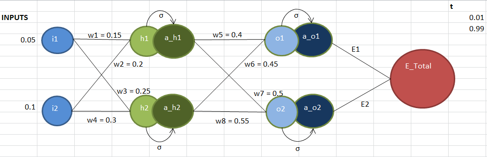
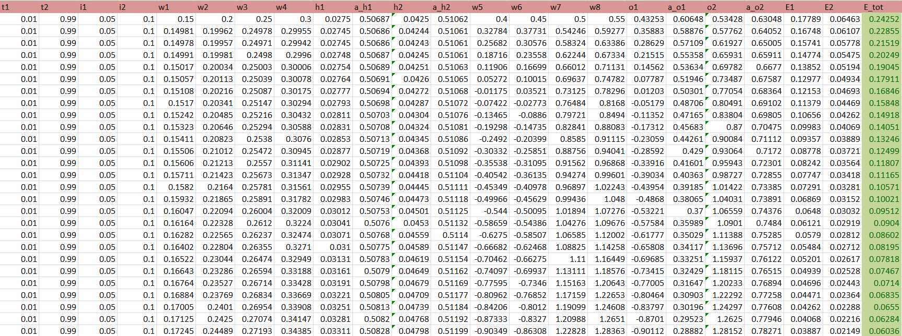
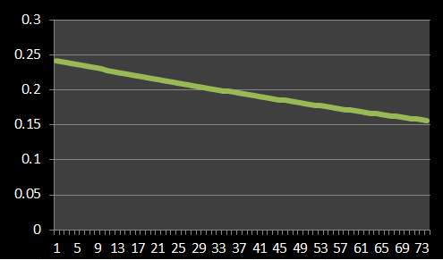
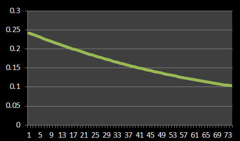
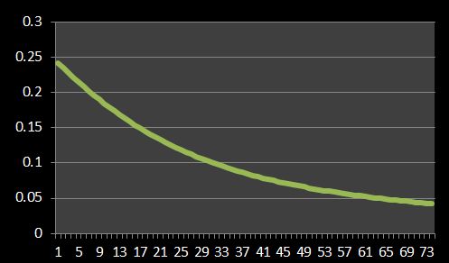
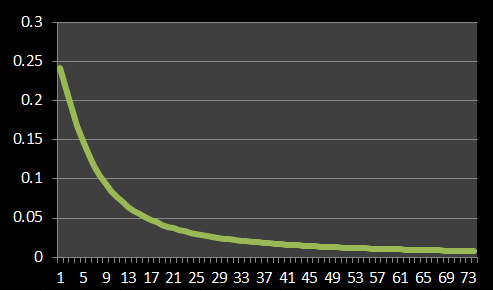

## PART 1
# **BACKPROPAGATION**

Back-propagation is the essence of neural network training. It is the practice of fine-tuning the weights of a neural network based on the error rate (i.e. loss) obtained in the previous epoch (i.e. iteration). Proper tuning of the weights ensures lower error rates, making the model reliable by increasing its generalization.      
The goal of backpropagation is to optimize the weights so that the neural network can learn how to correctly map inputs to outputs.  
         
In the first part of the assignment, we did backpropagation on the following image in excel sheet:       



It has two input neurons i1 and i2. These neurons are connected to two hidden neurons h1 and h2. These hidden neuron is activated using sigmoid activation function. Then its connnected to output neurons o1 and o2. Sigmoid activtion is appiled on the ouptut neuron and finally we get our **Error Rate**.


```
Inputs are given as:
  i1 = 0.05; i2 = 0.1
And initially the weights are:
  w1 = 0.15; w2 = 0.2, w3 = 0.25, w4 = 0.3
  w5 = 0.4, w6 = 0.45, w7 = 0.5, w8 = 0.55
```

The data on excel sheet looks like this:     


## **Important Steps**:
                   
### **Forward Pass**      
           
First, the information is passed in the forward direction. So, inputs are passed through the network by multiplying the inputs to the weights and h1 and h2 are calculated.


```
h1 = w1 * i1 + w2 + i2
h2 = w3 * i1 + w4 * i2
```

Then, `σ`(sigmoid function) is applied as an activation function on the hidden layers h1 and h2 to get their output. This helps in adding non-linearity to the network.


```
a_h1 = σ(h1) = 1/(1+exp(-h1))
a_h2 = σ(h2) = 1/(1+exp(-h2))
``` 

We repeat the same procedure for the output layer neurons. a_h1 and a_h2 are used as the inputs to the output neurons o1 and o2.


```
o1 = w5 * a_h1 + w6 * a_h2
o2 = w7 * a_h1 + w8 * a_h2
```
On appling activation function, we get a_o1 and a_o2 as:

```
a_o1 = σ(o1) = 1/(1+exp(-o1))
a_o2 = σ(o2) = 1/(1+exp(-o2))
```
  
Next, we calculate the error for each output neurons and sum them up to get the total error (E_total). We calculate E1 and E2 as:


```
E1 = ½ * ( t1 - a_o1)²
E2 = ½ * ( t2 - a_o2)²
```
Finally we get our total error as:

```
E_Total = E1 + E2
```
          
### **Backward Pass**        
            
As we already know, backpropagation is the practice of fine-tuning the weights of a neural network based on the loss obtained in the previous iteration so that the neural network can learn how to correctly map inputs to outputs. This is done by calculating the gradients and updating the weights respectively..

The weight updation starts from output to input. So the weight connected between the hidden layer and output layer gets updated first. The weights connected between these layers are w5, w6, w7, w8.

First we calculate the partial derivative of E_total with respect to w5 as follows:


```
δE_total/δw5 = δ(E1 +E2)/δw5
δE_total/δw5 = δ(E1)/δw5          [since E2 will have no effect on w5]

Using chain rule, we'll get:

δE_total/δw5 = (δE1/δa_o1) * (δa_o1/δo1) * (δo1/δw5)

Finding values for each term in the above equation:
δE1/δa_o1 = δ(1/2 * (t1 - a_o1)^2) / δa_o1 = (t1 - a_o1)*(-1) = a_o1 - t1 
δa_o1/δo1 = δ(σ(o1))/δo1 = σ(o1) * (1 - σ(o1)) = a_o1 * (1 - a_o1)
δo1/δw5 = a_h1

Combining every term, we get δE_total/δw5 as:
δE_t/δw5 = (a_o1 - t1) * a_o1 * (1 - a_o1) * a_h1

Similarly, we find partial derivative of E_total with respect to w6, w7 and w8:
δE_t/δw6 = (a_o1 - t1) * a_o1 * (1 - a_o1) * a_h2
δE_t/δw7 = (a_o2 - t2) * a_o2 * (1 - a_o2) * a_h1
δE_t/δw8 = (a_o2 - t2) * a_o2 * (1 - a_o2) * a_h2
```

Now, we calculate the gradients of weights connected between the hidden layer and input neuron wrt E_total.


```
δE_total/δa_h1 = δ(E1+E2)/δa_h1 
δE_total/δa_h1 = δE1/δa_h1 + δE2/δa_h1

Now, calculating δE1/δa_h1 and δE2/δa_h1 separately:
δE1/δa_h1 = (a_o1 - t1) * a_o1 * (1 - a_o1) * w5
δE2/δa_h1 = (a_o2 - t2) * a_o2 * (1 - a_o2) * w7

So, δE_total/δa_h1 will be:
δE_total/δa_h1 = (a_o1 - t1) * a_o1 * (1 - a_o1 ) * w5 + (a_o2 - t2) * a_o2 * (1 - a_o2 ) * w7

Similarly, 
δE_total/δa_h2 = (a_o1 - t1) * a_o1 * (1 - a_o1 ) * w6 + (a_o2 - t2) * a_o2 * (1 - a_o2 ) * w8
```

Calculate the gradient of E_total with respect to w1, w2, w3 and w4 as well using chain rule:


```
δE_total/δw1 = δE_total/δw1 = δ(E_total)/δa_o1 * δa_o1/δo1 * δo1/δa_h1 * δa_h1/δh1 * δh1/δw1
δE_total/δw1 = ((a_o1 - t1) * a_o1 * (1 - a_o1 ) * w5 + (a_o2 - t2) * a_o2 * (1 - a_o2 ) * w7) * a_h1 * (1- a_h1) * i1
               
Similarly,   
δE_total/δw2 = ((a_o1 - t1) * a_o1 * (1 - a_o1 ) * w5 + (a_o2 - t2) * a_o2 * (1 - a_o2 ) * w7) * a_h1 * (1- a_h1) * i2
δE_total/δw3 = ((a_o1 - t1) * a_o1 * (1 - a_o1 ) * w6 + (a_o2 - t2) * a_o2 * (1 - a_o2 ) * w8) * a_h2 * (1- a_h2) * i1
δE_total/δw4 = ((a_o1 - t1) * a_o1 * (1 - a_o1 ) * w6 + (a_o2 - t2) * a_o2 * (1 - a_o2 ) * w8) * a_h2 * (1- a_h2) * i2
```

Once we are done calculating gradients for all the weights, we update them by using the formula:


```
weight = weight - learning_rate * gradient_weight_calulated

Hence, we get w1, w2, w3 and w4 as follows:
w1 = w1 -  η* δE_total/δw1
w2 = w2 -  η* δE_total/δw2
w3 = w3 -  η* δE_total/δw3
w4 = w4 -  η* δE_total/δw4

Similarly, we get it for w5, w6, w7 and w8 as well.
```

We repeat this entire process for forward and backward pass until we get minimum error.

The error graph for learning rate - 0.1, 0.2, 0.5, 0.8, 1, 2 are as follows:          
Error graph for ***learning rate - 0.1***             


Error graph for ***learning rate - 0.2***             


Error graph for ***learning rate - 0.5***             


Error graph for ***learning rate - 1.0***             


Error graph for ***learning rate - 2.0***             


We can notice how the graphs are tending towards minimum loss more rapidly as the learning rate is increasing.


---

## PART 2
# **INCREASING ACCURACY**

We have been given a colab notebook with a neural network code which is currently at an accuracy of 28% and our task is to bring it up to 99.4%.

**The CNN Pipeline** :            
Initially the code has 7 covolution layers with 2 maxpooling layers. And each convolution layer is activated using RELU function. Also, the total number of parameters is 6,379,786 which is alot and needs to be reduced.          
To increase the accuracy and decrease the number of parameters, we have used the CNN Pipeline which consists of 3 CNN layers each of 16, 32 and 50 channels respectively.        
Kernel size is selected to be 3x3 and padding is set to 1 to preserve the resolution of the channels at each CNN layer. 
Each channel has a BatchNormalization, MaxPooling and Dropout step to it which ensures high accuracy but only if these points are kept in mind:           
            
***THE DISTANCE OF BATCH NORMALIZATION FROM PREDICTION:***      
Batch normalization is used after every layer but never before the last layer.      
          
***THE DISTANCE OF MAXPOOLING FROM PREDICTION:***            
Max-pooling is always done as far as possible from the final layers. Max-pooling applied at the final layers would lead to some serious loss of information misleading the final prediction. 

***WHEN DO WE INTRODUCE DROPOUT, OR WHEN DO WE KNOW WE HAVE SOME OVERFITTING:***       
Dropout is used at each and every layer, with very minimal values of p. We witness the overfitting when the Train Loss decreases, but the validation loss increases.
This happens in a overly complex model with large number of parameters.   
Droput step is used at the end of all the CNN layers. Dropout values of 0.2 , 0.25, 0.5, 0.8 has been experimented. 

The Fully Connected layer : The output of the CNN Pipeline is fed to a fully connected layer with 10 neurons.      
                  
Training has been done on GPU       
Learning rate = 0.01 and momentum = 0.9 and batch size = 128        
After implementing all the changes, the total number of parameters of the network reduced to 19,848 (< 20k) and the number of epochs trained is 19 (< 20 epochs)
The average test accuracy for the last 4 epochs (of the all 19 epochs ) is 99.30%.

    

