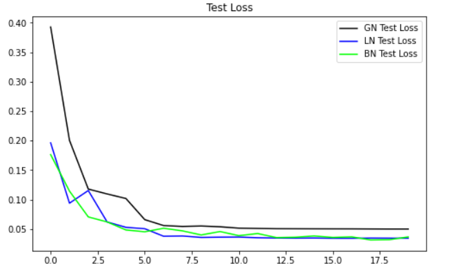
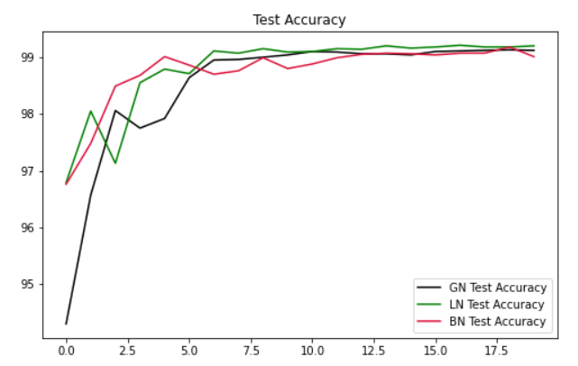
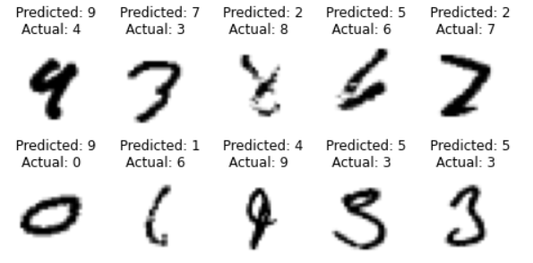
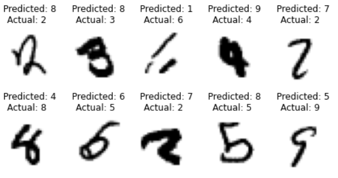
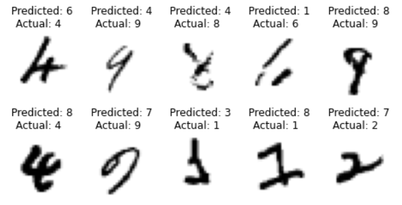

## **1. WHAT IS THIS CODE ALL ABOUT**      
Considering the best model from the Assignment 5, this code has been developed to train the model using three normalization techniques i.e. "Group Normalization", "Layer Normalization" and "L1 + Batch Normalization" (one at a time) and analyse the difference in Test loss and accuracy for all the three normalization techniques. We also plot 10 misclassified images for all the three cases.


## **2. HOW TO PERFORM THE ABOVE THREE NORMALIZATION:**      

**Syntax used for Group Normalization:**


```
torch.nn.GroupNorm(num_groups, num_channels)
```
NOTE: num_channels should always be divisible by num_groups.    
           
           
**Syntax used for Layer Normalization:**


```
torch.nn.LayerNorm(normalized_shape) 
```

GroupNorm can also be used to implement layer normalization by keeping num_groups = 1

```
torch.nn.GroupNorm(1, num_channels)
```

**Syntax used for Batch Normalization + L1 Regularization:**

*For Batch Normalization:*
```
torch.nn.BatchNorm2d(num_channels)
```
*For L1 Regularization:*
      
```
loss = F.nll_loss(y_pred, target)
l1 = 0
for W in model.parameters():
  l1 = l1 + W.abs().sum()
loss = loss + lambda_l1 * l1
loss.backward()
optimizer.step()
```

## **3. MY FINDINGS ON NORMALIZATION TECHNIQUES:**  
**Group Normalization:**       
Group normalization can be said as an alternative to batch normalization. This approach works by dividing the channels into groups and computes within each group the mean and variance for normalization i.e. normalising the features within each group.        
When G = C, which means each group has only 1 channel, GN becomes Instance NNormalization. On the other hand, when G = 1, GN becomes Layer Normalization. Therefore G controls the interpolation between IN and LN.       
              
**Layer Normalization:**    
Layer normalization normalizes input across the features instead of normalizing input features across the batch dimension in batch normalization.     
Layer Normalization  increses the number of parameters at each layer. Also the accuracy in this case is stable and as desired.              
              
**Batch norm + L1 Reg:**         
Batch normalization is a method that normalizes activations in a network across the mini-batch of definite size. It is a good normalization technique for accuracy and faster convergence. But when combined with L1 Regularization, the performance of the model is quite dependent on lambda value, higher the lambda value, lower the performance. So lower the lambda value for a better performance.

## **4. MODEL TRAIN AND TEST ACCURACY AND LOSS GRAPH:**     

<u>**Test Loss graph for all the three techniques:**</u>    
      
        

<u>**Test Accuracy graph for all the three techniques:**</u>     

            
 
## **5. COLLECTION OF MISCLASSIFIED IMAGES:**

<u>**Misclassified Images in case of "Group Normalization":**</u>        
          
       

<u>**Misclassified Images in case of "Layer Normalization":**</u>         
    
        

<u>**Misclassified Images in case of "L1 + Batch Normalization":**</u>          
            
